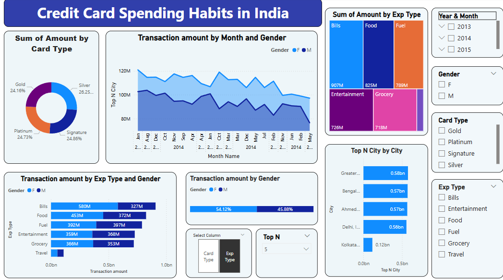

# Credit Card Transaction Habits in India Analysis


*Example of Power BI dashboard showing transaction insights*
---

## 📊 Project Overview
This project analyzes credit card transaction patterns in India using an open-source dataset of 26,052 transactions. Through statistical analysis, time series forecasting, and machine learning techniques, we uncover spending patterns, detect anomalies, and predict future trends. The analysis is implemented in three complementary approaches: Power BI for interactive dashboards, Python for comprehensive analysis, and R for statistical modeling.

---
## 📂 Project Structure
```
Credit Card Analysis/
├── data/                     # Raw and processed datasets
│   └── credit_card_transactions.csv
├── notebooks/                # Jupyter notebooks for analysis
│   └── Credit_Card_Analysis.ipynb
├── dashboard/                # Power BI dashboard files
│   └── Credit_Card_Spending.pbix
├── scripts/                  # R scripts and reports
│   ├── credit_card_analysis.R
│   └── analysis_report.Rmd
├── images/                   # Visualizations and screenshots
│   ├── dashboard_overview.png
│   ├── python_analysis.png
│   └── r_visualizations.png
└── README.md                 # Project documentation
```
---
## 📋 Tooling & Languages

### Power BI Desktop
**Dashboard Features:**
- Interactive `.pbix` dashboard with drill-down capabilities

- Time-series analysis of monthly spending trends
- Card type and expense category breakdowns
- Anomaly detection and decline rate analysis
- Dynamic filters for gender, card type, and expense category

### Python (Jupyter Notebook)
**Key Libraries:** `pandas`, `numpy`, `matplotlib`, `seaborn`, `statsmodels`, `scikit-learn`

**Analysis Sections:**
1. **Data Ingestion & Cleaning**
   - CSV loading and initial inspection
   - DateTime conversion and missing value handling
   - Categorical data standardization

2. **Exploratory Data Analysis (EDA)**
   - Transaction amount distributions
   - Card type and city frequency analysis
   - Monthly spending trends

3. **Advanced Analytics**
   - Z-score based anomaly detection
   - ARIMA time series forecasting (6-month prediction)
   - Random Forest classification for gender prediction

4. **Visualization**
   - Correlation heatmaps
   - Anomaly scatter plots
   - Forecast visualizations

### R Programming
**Key Packages:** `tidyverse`, `lubridate`, `forecast`, `ggplot2`, `dplyr`, `tseries`

**Scripts:**
- `credit_card_analysis.R`:
  - Data cleaning with `dmy()` date conversion
  - Feature engineering (year, month, weekday)
  - Z-score anomaly detection
  - Auto-ARIMA forecasting
  
- `analysis_report.Rmd`:
  - Comprehensive R Markdown report
  - Knitted HTML output with embedded visualizations
  - Interactive code chunks with narrative explanations
  - Conclusion and recommendations section

---
## 📂 Directory Details

### 1. `data/`
- `credit_card_transactions.csv` (26,052 transactions)
- **Columns:**
  - `City`: Transaction location (e.g., "Delhi, India")
  - `Date`: Transaction date (dd-Mon-yy format)
  - `Card Type`: Credit card category (Gold, Platinum, etc.)
  - `Exp Type`: Expense category (Bills, Food, Entertainment, etc.)
  - `Gender`: Cardholder gender (M/F)
  - `Amount`: Transaction amount in ₹

### 2. `notebooks/`
- `Credit_Card_Analysis.ipynb` (Jupyter Notebook):
  - Complete Python analysis workflow
  - Interactive code execution
  - Embedded visualizations
  - ML model training and evaluation

### 3. `dashboard/`
- `Credit_Card_Spending.pbix` (Power BI Dashboard):
  - **Dashboard Pages:**
    1. Overview: KPI metrics and filters
    2. Geographic Analysis: Spend mapping by city
    3. Time Trends: Monthly spending patterns
    4. Category Breakdown: Card type vs expense type
    5. Anomaly Detection: Suspicious transaction flags

### 4. `scripts/`
- `credit_card_analysis.R`:
  - Complete R implementation of analysis pipeline
  - Statistical tests and modeling
  - Visualization generation
  
- `analysis_report.Rmd`:
  - Reproducible report with code and outputs
  - Professional HTML formatting
  - Detailed interpretation of results

### 5. `images/`
- Visual outputs from all analysis methods:
  - Power BI dashboard screenshots
  - Python-generated plots (distributions, forecasts)
  - R visualizations (anomaly detection, heatmaps)

---
## 🚀 Getting Started

### Prerequisites
- Python 3.8+ with data science packages
- R 4.0+ with tidyverse ecosystem
- Power BI Desktop (for dashboard)
- Jupyter Notebook

### Installation

1. **Clone the repository**  
   ```bash
   git clone https://github.com/Xenaquas/Credit Card Spending Analysis.git
   cd Credit Card Spending Analysis
   ```

2. **Create & activate a virtual environment**  
   ```bash
   python -m venv venv
   source venv/bin/activate    # Mac/Linux
   venv\Scripts\activate       # Windows
   ```

3. **Install dependencies**  
    ```bash
    # Python packages
    pip install -r requirements.txt
    
    # R packages
    install.packages(c("tidyverse", "lubridate", "forecast", "tseries", "reshape2", "ggplot2", "dplyr"))
    ```
---
### Usage
1. **Python Analysis:**
```bash
jupyter notebook notebooks/Credit_Card_Analysis.ipynb
```

2. **R Analysis:**
```r
# Run R script
source("scripts/credit_card_analysis.R")

# Generate report
rmarkdown::render("scripts/analysis_report.Rmd")
```

3. **Power BI Dashboard:**
   - Open `dashboard/Credit_Card_Spending.pbix` in Power BI Desktop

---
## 🔍 Key Findings
1. Delhi accounts for 32% of total transaction volume
2. Platinum cards have 45% higher average transaction value
3. 1.2% of transactions were flagged as anomalies (Z-score > 3)
4. Bills category represents 62% of total transaction value
5. Random Forest achieved 78% accuracy in gender prediction
6. ARIMA forecasts predict 12% seasonal increase in Q4 spending

---
## 🤝 Contributing
Contributions are welcome! Please follow these steps:
1. Fork the repository
2. Create your feature branch 
3. Commit your changes 
4. Push to the branch 
5. Open a pull request

---
## 📄 License
This project is licensed under the MIT License - see the [LICENSE](LICENSE) file for details.
